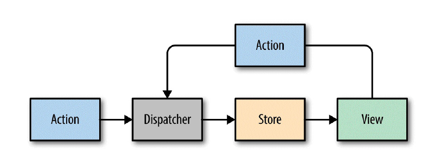

# react原理

virtual DOM 由 react element 组成 是 JavaScript object

react.createElement  生成 react element

>参数: attributes,properties,childrens

ReactDOM.render 把 react element 使用DOM API 转化为 DOM element

# 三种不同的创造组件的方法

## React.createClass

```jsx
const IngredientsList = React.createClass({
displayName: "IngredientsList",
renderListItem(ingredient, i) {
return React.createElement("li", { key: i }, ingredient)
},
render() {
return React.createElement("ul", {className: "ingredients"},
this.props.items.map(this.renderListItem)
)
}
})
```

>最早的方法

## 继承React.Component

```jsx
class IngredientsList extends React.Component {
renderListItem(ingredient, i) {
return React.createElement("li", { key: i }, ingredient)
}
render() {
return React.createElement("ul", {className: "ingredients"},
this.props.items.map(this.renderListItem)
)
}
}
```

## Stateless Functional Components

一个接受props返回 react element的函数

没有this？

>使用class this是绑定在object
>
>但是函数的this指代不明 最好不用

**Stateless functional components are functions that take in properties and return**
**a DOM element.**

```jsx
const IngredientsList = ({items}) =>
React.createElement("ul", {className: "ingredients"},
items.map((ingredient, i) =>
React.createElement("li", { key: i }, ingredient)
)
)
```


# Factories

**If you would like to simplify your code by calling components as functions,**
**you need to explicitly create a factory**

```jsx
const { render } = ReactDOM;
const IngredientsList = ({ list }) =>
React.createElement('ul', null,
list.map((ingredient, i) =>
React.createElement('li', {key: i}, ingredient)
)
)
const Ingredients = React.createFactory(IngredientsList)
const list = [
"1 lb Salmon",
"1 cup Pine Nuts",
"2 cups Butter Lettuce",
"1 Yellow Squash",
"1/2 cup Olive Oil",
"3 cloves of Garlic"
]
render(
Ingredients({list}),
document.getElementById('react-container')
)
```

#  JSX

props destructuring

# refs

## in ES6 class

```jsx
import { Component } from 'react'
class AddColorForm extends Component {
constructor(props) {
super(props)
this.submit = this.submit.bind(this)
}
submit(e) {
const { _title, _color } = this.refs
e.preventDefault();
alert(`New Color: ${_title.value} ${_color.value}`)
_title.value = '';
_color.value = '#000000';
_title.focus();
}
render() {
return (
<form onSubmit={this.submit}>
<input ref="_title"
type="text"
placeholder="color title..." required/>
<input ref="_color"
type="color" required/>
<button>ADD</button>
</form>
)
}
}
```

## in Stateless Functional Components

```jsx
const AddColorForm = ({onNewColor=f=>f}) => {
let _title, _color
const submit = e => {
e.preventDefault()
onNewColor(_title.value, _color.value)
_title.value = ''
_color.value = '#000000'
_title.focus()
}
return (
<form onSubmit={submit}>
<input ref={input => _title = input}
type="text"
placeholder="color title..." required/>
<input ref={input => _color = input}
type="color" required/>
<button>ADD</button>
</form>
)
}
```

# Flux



使用Action表示程序变化

>Every change requires an action. Every action provides the instructions to make the change.

把特定的Action传给Dispatcher,Dispatcher管理Action队列，然后把Action传给特定的Store,Store收到Action之后就改变自身的数据，然后通知View重绘。

## Action Creators

Action 对应的函数 给指定的 dispatcher 发送 action

```jsx
const countdownActions = dispatcher =>
({
tick(currentCount) {
dispatcher.handleAction({ type: 'TICK' })
},
reset(count) {
dispatcher.handleAction({
type: 'RESET',
count
})
}
})
```


## View

从属性获取

tick()、count()

让View有发出Action的能力

```jsx
const Countdown = ({count, tick, reset}) => {
if (count) {
setTimeout(() => tick(), 1000)
}
return (count) ?
<h1>{count}</h1> :
<div onClick={() => reset(10)}>
<span>CELEBRATE!!!</span>
<span>(click to start over)</span>
</div>
}
```


## Dispatcher

接受 Action ，把 Action 送给对应的store（store注册dispatcher）

```jsx
import Dispatcher from 'flux'
class CountdownDispatcher extends Dispatcher {
handleAction(action) {
console.log('dispatching action:', action)
this.dispatch({
source: 'VIEW_ACTION',
action
})
}
}
```


## Stores

继承于EventEmitter

View 把 不同Action 对应的 UI改变 代码传给store，store在制定事件发生时调用View的代码改变UI。

```jsx
import { EventEmitter } from 'events'
class CountdownStore extends EventEmitter {
constructor(count=5, dispatcher) {
super()
this._count = count
this.dispatcherIndex = dispatcher.register(
this.dispatch.bind(this)
)
}
get count() {
return this._count
}
dispatch(payload) {
const { type, count } = payload.action
switch(type) {
case "TICK":
this._count = this._count - 1
this.emit("TICK", this._count)
return true
case "RESET":
this._count = count
this.emit("RESET", this._count)
return true
}
}
```

## main.py

```jsx
const appDispatcher = new CountdownDispatcher()
const actions = countdownActions(appDispatcher)
const store = new CountdownStore(10, appDispatcher)
const render = count => ReactDOM.render(
<Countdown count={count} {...actions} />,
document.getElementById('react-container')
)
store.on("TICK", () => render(store.count))
store.on("RESET", () => render(store.count))
render(store.count)
```

## 总结

Action->Dispatcher

>Action Creater 调用 Dispatcher.handleAction 在 Dispatcher的队列中加入 Action

Dispatcher->Stroe

>Store里调用 Dispatcher的register把自己的事件处理代码 给Dispatcher

Store->View

>View订阅Store的事件